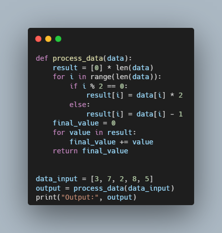

## Table 1: First Test Run

| Code | Code Snippet     | Task Description | Proposed Facets | Detected Problems |
|------|------------------|----------------- |-----------------|-------------------|
|Fr1x1 | |                 |                  |
|Fr1x2 | See code snippet Fr1x1|                 |                  |
|Fr1x3 |See code snippet Fr1x1                 |                 |                  |
|Fr2x1 |
|Fr2x2 |See code snippet Fr2x1  
|Fr2x3 |See code snippet Fr2x1  

## Table 2: Second Test Run

| Code | Task Description | Tested Facet | Improvements |
|------|------------------|--------------|--------------|
|      |                  |              |              |
|      |                  |              |              |
|      |                  |              |              |
